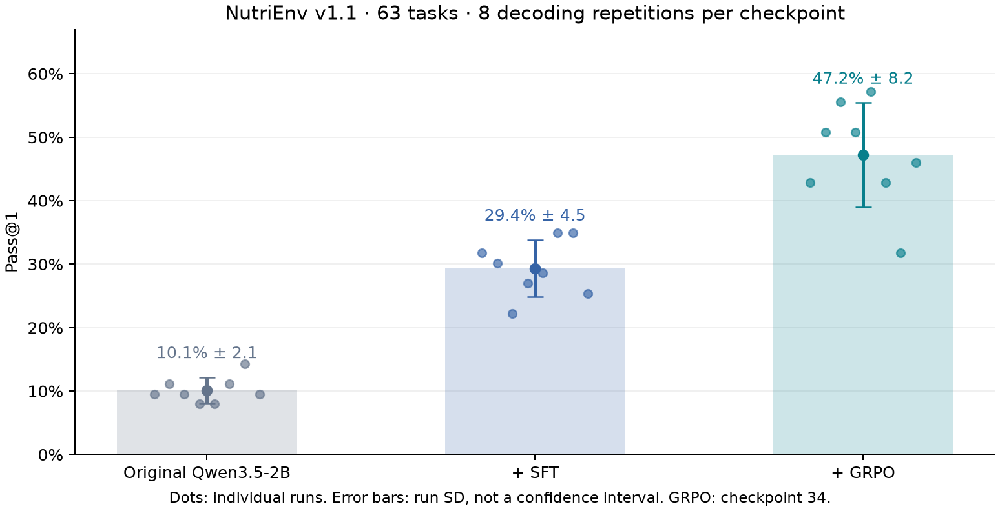
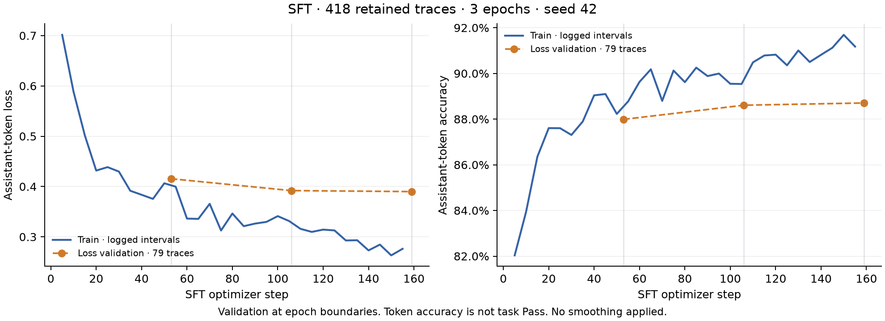
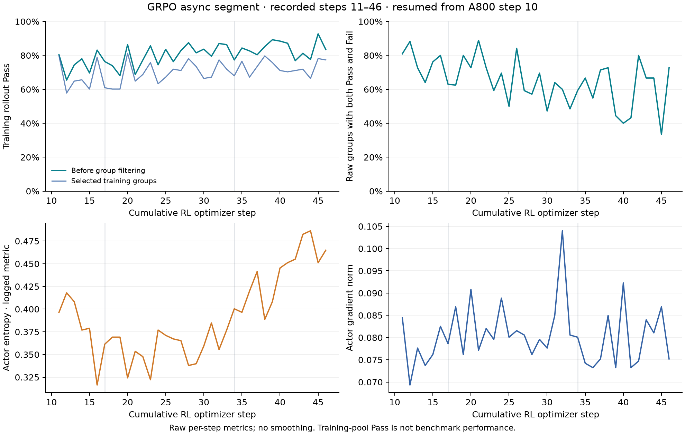
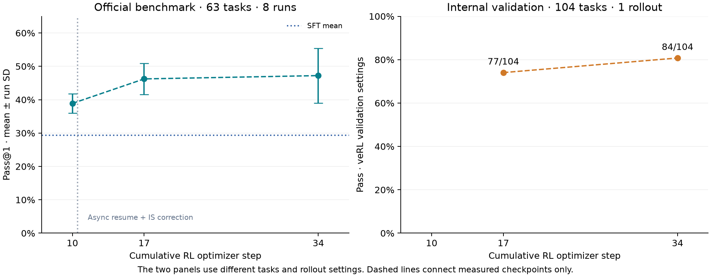

# NutriMind

NutriMind v2 trains Qwen3.5-2B to complete nutrition tasks through multi-turn tool calls in [NutriEnv](https://github.com/SnackJJ/NutriEnv). The pipeline combines supervised fine-tuning on verified teacher trajectories with GRPO using environment-scored Pass/Fail rewards.

On the recorded NutriEnv v1.1 evaluation, mean Pass@1 increases from **10.1%** for the original model to **29.4%** after SFT and **47.2%** after GRPO. Each student checkpoint is evaluated eight times on the same 63 tasks. This report covers the experiments available on 2026-10-04.

## Experiment results

Pass means the environment's end state satisfies the task oracle according to the NutriEnv scorer. It measures task completion across profile updates, meal logging, plan evaluation, recommendations, and composite workflows.

| Model / training method | Pass@1, mean ± run SD | Observed Pass@8 | Evaluation runs |
|---|---:|---:|---:|
| Original Qwen3.5-2B | 10.1% ± 2.1 pp | 27.0% | 8 |
| + SFT | 29.4% ± 4.5 pp | 65.1% | 8 |
| + GRPO¹ | 47.2% ± 8.2 pp | 76.2% | 8 |
| DeepSeek-V4.1-Flash teacher² | 87.3% ± 2.7 pp | Not measured at k=8 | 3 |

¹ GRPO denotes the checkpoint at cumulative RL optimizer step 34. This identifies the reported artifact; no claim is made that it is the final or optimal checkpoint. Earlier measured checkpoints appear in the training analysis below.

² The teacher is a reference on the same benchmark, with temperature 0 and reasoning effort `high`. Its three runs are separate from the eight-run student matrix.

`pp` means percentage points. SD is the sample standard deviation across decoding repetitions, not across independent training seeds. Observed Pass@8 is the fraction of tasks passed at least once in eight attempts with oracle scoring. Each student model has 504 episodes but only 63 distinct test tasks. All 2,520 episodes in the five-checkpoint student matrix have zero infrastructure voids.



SFT improves Pass@1 by 19.2 percentage points over the original model. GRPO improves it by a further 17.9 points over SFT. Paired bootstrap resampling of the 63 tasks gives 95% intervals of [13.5, 25.4] and [12.3, 23.6] points, respectively. These intervals are conditional on the trained checkpoints and do not account for adaptive benchmark development or model selection.

### Evaluation protocol

| Setting | Recorded value |
|---|---|
| Benchmark | NutriEnv v1.1, 63 tasks |
| Runner | Official `scripts/eval_benchmark_suite.py`, recorded revision `c0eddd7` |
| Tool protocol | `native-tools` |
| Prompt | `p6-amdr-window-ranges`, fingerprint `c45264405c…` |
| Scorer / loop | `s7-amdr-windows` / `l2-refused-handin-continues` |
| Student sampling | Temperature 1.0, top_p 0.95, top_k 20, presence penalty 1.5 |
| Reasoning | `enable_thinking: true` |
| Serving | vLLM 0.29, bf16, model context limit 65,536 |
| Concurrency | 16 evaluation workers |

The student matrix uses identical task IDs, prompt fingerprint, scorer, loop, and sampling settings. Each episode resets an independent environment to its task's initial state. The runner revision is recorded in the launch scripts; the JSON reports record the protocol versions and fingerprint. Earlier NutriMind `eval_exam.py` results and NutriEnv v1.0 scores are excluded from this report.

## Data and training

The data factory authors off-exam tasks, checks that their oracles are achievable, runs the teacher in the real environment, and retains passing trajectories. SFT trains on assistant turns while masking user and tool observations. GRPO then runs the student against task oracles with binary rewards.

| Dataset / artifact | Size and use |
|---|---|
| SFT B1 + B2 + B2b | 419 records before replay filtering; 418 retained training trajectories |
| SFT problem identities | 369 distinct `{query, initial state, oracle}` identities in the exporter audit |
| SFT loss validation | 79 trajectories, used for token loss monitoring |
| SFT difficulty probe | 418 training tasks × 8 rollouts = 3,344 episodes |
| RL training pool | 286 tasks selected from mixed Pass/Fail groups in the SFT training pool |
| RL validation | 104 tasks after removing 26 SFT-seen problem identities and 2 duplicates from 132 candidate holdouts |

The probe found 291 mixed groups. The 286 RL tasks come from the composite, evaluate, and recommend families. Probe scores measure training-pool difficulty, not held-out performance. Dataset counts above follow the saved training and export manifests.

### Supervised fine-tuning

| Setting | Value |
|---|---|
| Base model | `Qwen/Qwen3.5-2B` |
| Adapter | LoRA rank 32, alpha 64, dropout 0.05 |
| Target modules | Attention and linear-attention projections, plus MLP projections |
| Training | 3 epochs, 159 optimizer steps, seed 42 |
| Batch | 1 trajectory × gradient accumulation 8 |
| Optimizer schedule | Learning rate 1e-4, cosine decay, 16 warmup steps |
| Context / precision | 20,480 tokens, bf16, gradient checkpointing |
| Loss implementation | Liger chunked cross-entropy |
| Hardware / runtime | 1 × RTX 4090, 1,606 seconds |



Training loss falls from 0.702 in the first logged interval to 0.276 in the last. Validation loss is 0.4155, 0.3919, and 0.3899 at the three epoch boundaries, while final validation token accuracy is 88.7%. Validation improvement slows after epoch two even as training loss continues to fall. Token accuracy measures imitation of assistant outputs; environment Pass remains the task metric.

Training follows [the SFT configuration](configs/sft_v2_lora.batch12.yaml) and [the replay-aware SFT trainer](src/training/sft/train_v2.py). Replay filtering removes one trajectory whose terminal hand-in was refused and checks the message/token alignment against the environment loop.

### Reinforcement learning

GRPO uses 16 prompts × 8 rollouts per selected update, a learning rate of 2e-5, and a KL loss coefficient of 0.01 against the frozen SFT reference. Dynamic group filtering retains groups with reward variation. A800 training produces checkpoint 10; training then resumes on two RTX 4090s with separate asynchronous rollout and token-level importance-sampling correction.

The [A800 configuration](configs/grpo_v2_a800_bs16.yaml) records the base training settings. The [saved async runtime metadata](reports/nutrimind-v2/metrics.json) records dependencies, source-file hashes, and metrics for cumulative steps 11–46. The async segment's nominal budget is 51 steps; the latest saved checkpoint marker is 34. Completion of the full budget is not established by the available artifacts.



The top-left panel separates the sampled rollout Pass rate before filtering from the selected training groups. The top-right panel shows the fraction of raw groups containing both Pass and Fail, which can contribute reward-relative learning signals. Removing all-pass groups can make selected-group Pass lower than raw Pass. These values describe a difficulty-selected training pool and should not be read as benchmark scores.

Actor entropy remains nonzero and the recorded gradient norms remain finite and positive through this segment. These diagnostics help detect learning-signal loss and optimization problems; they do not establish convergence or generalization. All curves use the logged values without smoothing.

### Checkpoint evaluation



| Cumulative RL step | Official benchmark Pass@1, 8-run mean ± SD | Internal validation, 1 rollout per task |
|---|---:|---:|
| 10, A800 | 38.9% ± 2.9 pp | Not in the saved JSONL segment |
| 17, async resume | 46.2% ± 4.7 pp | 77/104, 74.0% |
| 34, async resume | 47.2% ± 8.2 pp | 84/104, 80.8% |

The two panels use different task sets, token budgets, and sampling settings. Internal validation cannot be directly compared with the official benchmark. Step 10 → 17 also changes rollout scheduling and importance-sampling correction, so it is not a controlled comparison of training duration alone.

Step 34 exceeds step 17 by only 1.0 point on the official benchmark, with a paired task-bootstrap interval of [−3.8, 6.0]. The larger run-to-run SD at step 34 and this interval do not establish a further benchmark gain.

## Task breakdown and remaining failures

| Task family | Distinct tasks | Original model | + SFT | + GRPO, checkpoint 34 |
|---|---:|---:|---:|---:|
| Composite | 36 | 3.5% | 27.1% | 50.3% |
| Evaluate | 8 | 18.8% | 40.6% | 50.0% |
| Log | 6 | 10.4% | 14.6% | 16.7% |
| Recommend | 11 | 9.1% | 23.9% | 42.0% |
| Update | 2 | 100.0% | 100.0% | 100.0% |

The largest gains are in composite and recommendation tasks. Logging remains weak. The two update tasks are already passed by the original model, so their perfect score offers little evidence of learning.

Across eight runs, `window` failures decrease from 125 after SFT to 64 after GRPO, while `log_miss` decreases from 130 to 110. Mean completion tokens per episode rise from 1,702 to 2,410. These are output tokens; repeatedly submitted prompt tokens are excluded. Higher task Pass accompanies higher output-token consumption in this comparison.

SFT has 2 allergen-flagged episodes out of 504; the reported GRPO checkpoint has 1 out of 504. GRPO has zero recorded protocol violations, which is distinct from zero allergen violations. Held-out shopping and dish archetypes remain unsolved: both SFT and GRPO score 0/24 shopping episodes and 0/16 dish episodes.

## Scope of the conclusions

The recorded checkpoints support an improvement from the combined SFT and GRPO pipeline on NutriEnv v1.1. Several limits matter when interpreting that improvement:

- Batch 2 task coverage was designed after inspecting Batch 1 benchmark failures. The benchmark participated in development. Direct task isolation does not make it an untouched final test set.
- Eight evaluation repetitions measure decoding variation for each checkpoint. They do not measure variation across independently trained models.
- Data expansion changes both quantity and task coverage, and the A800-to-async transition changes the training configuration. These comparisons do not isolate individual mechanisms.
- The 104-task internal validation set has been monitored during training. A new, untouched task set is needed to confirm generalization after freezing the model and selection rule.
- The measured GRPO checkpoints belong to one resumed training trajectory. DAPO comparison results and a confirmed final step-51 result are not available.

## Reproduce the report

The repository includes a compact [metrics snapshot](reports/nutrimind-v2/metrics.json) with all student run counts, per-task average outcomes, SFT log history, the recorded async metrics, and SHA-256 hashes of the input artifacts. Raw trajectories, model weights, and full logs live under the gitignored `data/` directory. The snapshot supports figure/statistic inspection; reproducing model evaluation also requires those artifacts and the recorded NutriEnv runner.

Generate the four figures from the included snapshot:

```bash
uv run --script scripts/plot_experiments.py
```

Rebuild the snapshot from the original local artifacts and regenerate figures:

```bash
uv run --script scripts/plot_experiments.py --refresh
```

The [plotting script](scripts/plot_experiments.py) checks evaluation protocol equality, task IDs, reported pass counts, void counts, and the continuity of the recorded async segment when refreshing. It writes PNG images for the README and SVG versions for export to `reports/nutrimind-v2/`. Bootstrap intervals use 10,000 paired task resamples with seed 0.

The SFT manifest records NutriMind revision `2d55a5d…` with a dirty working tree. RL preflight records source-file hashes and dependency versions. The metrics snapshot retains these identities rather than treating a commit SHA alone as a complete training recipe. The consumed NutriEnv source revision is `47367d9…`; evaluation uses the separately recorded official runner revision `c0eddd7`.

## Repository layout

```text
configs/                     SFT, data-factory, and RL configurations
src/training/data_factory/   Off-exam task authoring and teacher trajectories
src/training/sft/            Replay checks, SFT training, and adapter export
src/training/rl/             Environment rollouts and veRL integration
infra/grpo/                  GPU runtime setup and training evidence
scripts/plot_experiments.py  Report extraction and plotting
reports/nutrimind-v2/        Metrics snapshot, PNG figures, and SVG exports
tests/training/              Data, protocol, and training integration checks
```

NutriMind v1's Qwen3-4B assistant, six-tool orchestrator, and RAG stack remain in the repository as engineering history. The v2 results above use Qwen3.5-2B and NutriEnv's native tool protocol. Versioning and scope are recorded in [ADR-010](docs/decisions/010-nutrimind-v2-rescope.md) and the [post-training stack decision](docs/decisions/015-v2-post-training-stack-trl-sft-verl-rl.md).

## License

MIT
